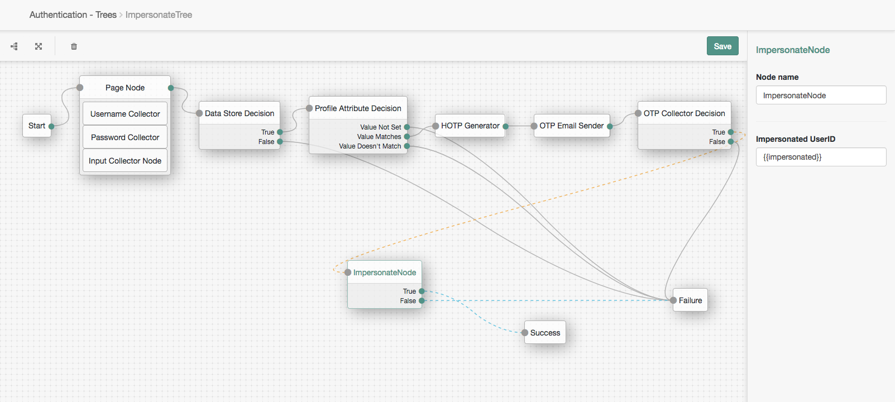
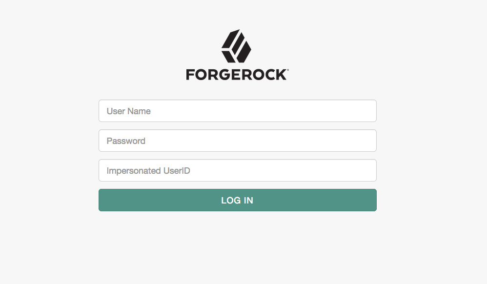
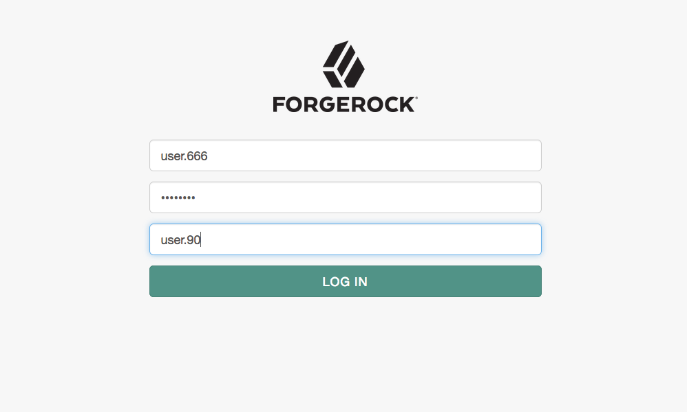
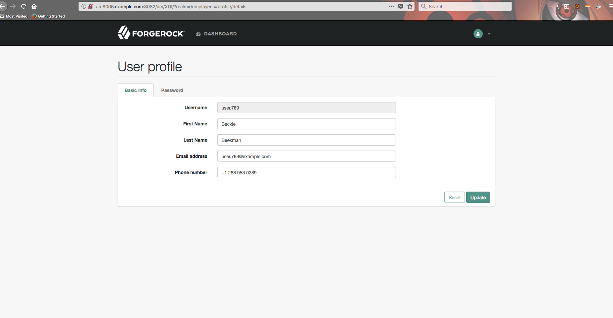

<!--
 * The contents of this file are subject to the terms of the Common Development and
 * Distribution License (the License). You may not use this file except in compliance with the
 * License.
 *
 * You can obtain a copy of the License at legal/CDDLv1.0.txt. See the License for the
 * specific language governing permission and limitations under the License.
 *
 * When distributing Covered Software, include this CDDL Header Notice in each file and include
 * the License file at legal/CDDLv1.0.txt. If applicable, add the following below the CDDL
 * Header, with the fields enclosed by brackets [] replaced by your own identifying
 * information: "Portions copyright [year] [name of copyright owner]".
 *
 * Copyright 2019 ForgeRock AS.
-->
# ImpersonateNode

An impersonator node for ForgeRock's [Identity Platform][forgerock_platform] 6.0 and above. This node just replaces the shared state "username" with userID that impersonator needs to impersonate.
Impersonation is a great power and "With Great Power Comes Great Responsibility". This means we need to make sure that only certain users can perform impersonation. 
In sample tree, we have added checks such as impersonator should have a specific role, perform MFA before impersonating. Also, auditing these events is highly encouraged.   


Copy the .jar file from the ../target directory into the ../web-container/webapps/openam/WEB-INF/lib directory where AM is deployed.  Restart the web container to pick up the new node.  The node will then appear in the authentication trees components palette.


**USAGE HERE**


The code in this repository has binary dependencies that live in the ForgeRock maven repository. Maven can be configured to authenticate to this repository by following the following [ForgeRock Knowledge Base Article](https://backstage.forgerock.com/knowledge/kb/article/a74096897).

**SPECIFIC BUILD INSTRUCTIONS HERE**

**Impersonation Tree**



**Login Screen: Refer field comments**



**Login Screen: User enters specific values**



**User Profile page for impersonated user**




**AUDITING**
1. During authentication, when this node completes, a `AM-NODE-LOGIN-COMPLETED` audit event is logged to authentication.audit.json.  The audit event records the **impersonatorUserID** and **impersonatedUserID**:
```
{"realm":"/employees","transactionId":"8f1f3ef9-cc3f-4930-9a46-2815b09502af-1078","component":"Authentication","eventName":"AM-NODE-LOGIN-COMPLETED","entries":[{"info":{"nodeOutcome":"true","treeName":"ImpersonateTree","displayName":"ImpersonateNode","nodeType":"ImpersonateNode","nodeId":"6578195d-b913-4133-a29b-62edb753f8e5","authLevel":"0","nodeExtraLogging":{"impersonatorUserID":"user.666","impersonatedUserID":"user.90"}}}],"principal":["user.90"],"timestamp":"2019-04-25T15:17:18.109Z","trackingIds":["8f1f3ef9-cc3f-4930-9a46-2815b09502af-978"],"_id":"8f1f3ef9-cc3f-4930-9a46-2815b09502af-1084"}
```
2. Additionally, AM leverages [trackingIds](https://backstage.forgerock.com/docs/am/6.5/maintenance-guide/#access-log-format) to correlate multiple events belonging to same session. This means trackingIds from authentication audit event can be used to correlate all operations performed by impersonator. 
   
   * Authenticate 
    ```
    curl -X POST \
      'http://am6002.example.com:8282/am/json/realms/root/realms/employees/authenticate?authIndexType=service&authIndexValue=ImpersonateTree' \
      -H 'Accept-API-Version: resource=2.0, protocol=1.0' \
      -H 'Content-Type: application/json' \
      -d '{
        "authId": "eyJ0e...",
        "callbacks": [
            {
                "type": "NameCallback",
                "output": [
                    {
                        "name": "prompt",
                        "value": "User Name"
                    }
                ],
                "input": [
                    {
                        "name": "IDToken0",
                        "value": "user.666"
                    }
                ],
                "_id": 0
            },
            {
                "type": "PasswordCallback",
                "output": [
                    {
                        "name": "prompt",
                        "value": "Password"
                    }
                ],
                "input": [
                    {
                        "name": "IDToken0",
                        "value": "password"
                    }
                ],
                "_id": 1
            },
            {
                "type": "NameCallback",
                "output": [
                    {
                        "name": "prompt",
                        "value": "Impersonated User ID"
                    }
                ],
                "input": [
                    {
                        "name": "IDToken0",
                        "value": "user.90"
                    }
                ],
                "_id": 2
            }
        ]
    }'
    ```
    Corresponding audit entry in authentication.audit.json  
    ```
    {"realm":"/employees","transactionId":"8f1f3ef9-cc3f-4930-9a46-2815b09502af-1078","component":"Authentication","eventName":"AM-NODE-LOGIN-COMPLETED","entries":[{"info":{"nodeOutcome":"true","treeName":"ImpersonateTree","displayName":"ImpersonateNode","nodeType":"ImpersonateNode","nodeId":"6578195d-b913-4133-a29b-62edb753f8e5","authLevel":"0","nodeExtraLogging":{"impersonatorUserID":"user.666","impersonatedUserID":"user.90"}}}],"principal":["user.90"],"timestamp":"2019-04-25T15:17:18.109Z","trackingIds":["8f1f3ef9-cc3f-4930-9a46-2815b09502af-978"],"_id":"8f1f3ef9-cc3f-4930-9a46-2815b09502af-1084"}
    ```

    * Validate: 
    ```
    curl -X POST \
     'http://am6002.example.com:8282/am/json/sessions?tokenId=yhxmmt5tGn21eBlaY4Cme_of3Jg.%2AAAJTSQACMDEAAlNLABxvNmdDVXFkM2FxdTZIRldMNjVtQXo2RTI5QlE9AAR0eXBlAANDVFMAAlMxAAA.%2A&_action=validate' \
     -H 'Accept-API-Version: resource=1.1' \
     -H 'Content-Type: application/json' 
    ```
    Corresponding audit entry in access.audit.json
    ```
    {"realm":"/","transactionId":"8f1f3ef9-cc3f-4930-9a46-2815b09502af-1119","userId":"id=user.90,ou=user,o=employees,ou=services,dc=openam,dc=forgerock,dc=org","client":{"ip":"192.168.56.1","port":51124},"server":{"ip":"192.168.56.132","port":8282},"http":{"request":{"secure":false,"method":"POST","queryParameters":{"_action":["validate"]},"headers":{"accept":["*/*"],"accept-api-version":["resource=1.1"],"host":["am6002.example.com:8282"],"postman-token":["28cfd04d-5d70-4556-bdf8-92c380528d8a"],"user-agent":["PostmanRuntime/7.6.1"]},"cookies":{"amlbcookie":"01"},"path":"http://am6002.example.com:8282/am/json/sessions"}},"request":{"protocol":"CREST","operation":"ACTION","detail":{"action":"validate"}},"timestamp":"2019-04-25T15:17:21.460Z","eventName":"AM-ACCESS-OUTCOME","component":"Session","response":{"status":"SUCCESSFUL","statusCode":"","elapsedTime":160,"elapsedTimeUnits":"MILLISECONDS"},"trackingIds":["8f1f3ef9-cc3f-4930-9a46-2815b09502af-978"],"_id":"8f1f3ef9-cc3f-4930-9a46-2815b09502af-1130"}
    ```
    
    * Common `trackingIds`: *8f1f3ef9-cc3f-4930-9a46-2815b09502af-978* can be used to filter audit logs for impersonated events.   


The sample code described herein is provided on an "as is" basis, without warranty of any kind, to the fullest extent permitted by law. ForgeRock does not warrant or guarantee the individual success developers may have in implementing the sample code on their development platforms or in production configurations.

ForgeRock does not warrant, guarantee or make any representations regarding the use, results of use, accuracy, timeliness or completeness of any data or information relating to the sample code. ForgeRock disclaims all warranties, expressed or implied, and in particular, disclaims all warranties of merchantability, and warranties related to the code, or any service or software related thereto.

ForgeRock shall not be liable for any direct, indirect or consequential damages or costs of any type arising out of any action taken by you or others related to the sample code.

[forgerock_platform]: https://www.forgerock.com/platform/  
